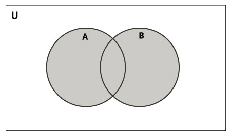
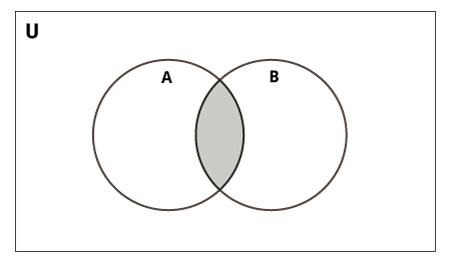
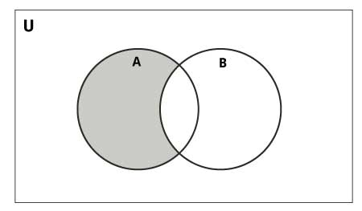
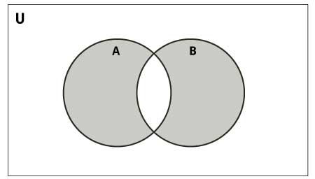

# Sets Cheatsheet

[Set Lectures](https://www.cse.msu.edu/~cse231/Online/dictionaries.html)

In computer science, **sets** (type name: `set`) are an unordered collection of unique elements. Sets are a type of **container**, but *cannot* hold mutable types (`list`, `dict`, and other `set` instances).

Sets *do not* have indices, and duplicate values are ignored upon initialization or appendation.

The `len()` function can be used to determine the number of elements within a set:

```python
my_set = {1, 2, 3, 3, 3}

# duplicate values are ignored
n = len(my_set)  # n : 3
```

If all of the elements within a given set are type `int` or `float`, the `sum()` function can be used to add together all values within the set. 

```python
my_set = {1, 2, 3, 3, 3}

# duplicate values are ignored
s = sum(my_set)  # s : 6
```

If all of the elements within a given set can be compared to one another, the `max()` and `min()` functions can be used to determine the maximum and minimum element of a set, respectively. 

```python
my_set = {1, 2, 3, 3, 3}

# duplicate values are ignored
maximum = max(my_set)  # maximum : 3
minimum = min(my_set)  # minimum : 1
```

Sets are **mutable**, meaning that they pass by reference.

Jump to section:
1. [Initialization](#initialization)
2. [Operations](#operations)
3. [Iteration](#iteration)
4. [Common Methods](#common-methods)
5. [Set Comprehensions](#set-comprehensions)

Want to learn more? [Check out Programiz's article on sets!](https://www.programiz.com/python-programming/set)

## Initialization

Sets can be declared using curly brackets (`{}`). However, using the curly brackets during initialization requires pre-set comma-separated values in order to differentiate from an empty dictionary. Meaning that, if an empty set is to be declared, one should use an empty `set()` call.

```python
# empty dictionary, do not use when trying to create
# an empty set!
empty_dictionary = {}

# empty set
my_set = set()

# set with initial values
my_set = {1, 2, 3}

# set with initial values, multi-line
my_set = {
    1,
    2,
    3
}
```

A set can also be declared as a conversion from a different type. 

```python
# list conversion
my_set = set([1, 2, 3, 3, 3])  # my_set : {1, 2, 3}

# string conversion
my_set = set('12333')  # my_set : {'1', '2', '3'}
```

## Operations

Sets are compatible with many unique operators, not often used by other classes. Many of these operators take inspiration from the concept of sets in mathematics.

If `A` and `B` are sets...

| Name                 | Operator | Example Usage | Returns | Description |
| :---:                | :---:    | :---:         | :---:   | :---:       |
| Union                | `\|`      | `A \| B`       | `set`   | Returns a new set comprised of all elements from both operand sets |
| Intersection         | `&`      | `A & B`       | `set`   | Returns a new set comprised of the elements shared between both operand sets |
| Difference           | `-`      | `A - B`       | `set`   | Returns a new set comprised of all elements in `A` that are not in `B` |
| Symmetric Difference | `^`      | `A ^ B`       | `set`   | Returns a new set comprised of all elements unique to both operand sets |
| Is Subset            | `<=`     | `A <= B`      | `bool`  | Tests whether every element in `A` is in `B` |
| Is Proper Subset     | `<`      | `A < B`       | `bool`  | Tests whether every element in `A` is in `B`, but `A` does not equal `B` |
| Is Superset          | `>=`     | `A >= B`      | `bool`  | Tests whether every element in `B` is in `A` |
| Is Proper Superset   | `>`      | `A > B`       | `bool`  | Tests whether every element in `B` is in `A`, but `B` does not equal `A` |

All operators have method function equivalents (see [Common Methods](#common-methods))

### Union

Returns a new set comprised of all elements from both operand sets. Think:

<center>

</center>

```python
A = {1, 2, 3, 4, 5}
B = {4, 5, 6, 7, 8}

C = A | B  # C : {1, 2, 3, 4, 5, 6, 7, 8}
```

### Intersection

Returns a new set comprised of the elements shared between both operand sets. Think:

<center>

</center>

```python
A = {1, 2, 3, 4, 5}
B = {4, 5, 6, 7, 8}

C = A & B  # C : {4, 5}
```

### Difference

Returns a new set comprised of all elements in `A` that are not in `B`. Think:

<center>

</center>

```python
A = {1, 2, 3, 4, 5}
B = {4, 5, 6, 7, 8}

C = A - B  # C : {1, 2, 3}
```

### Symmetric Difference

Returns a new set comprised of all elements unique to both operand sets. Think:

<center>

</center>

```python
A = {1, 2, 3, 4, 5}
B = {4, 5, 6, 7, 8}
 
C = A ^ B  # C : {1, 2, 3, 6, 7, 8}
```

### Membership Tests

The comparison operators return a boolean value that indicates whether one operand set is a subset, proper subset, superset, or proper superset of a second operand set.

A set, `A`, is considered a subset of another set, `B`, if all elements in `A` are also in `B`. If `A` is a subset of `B`, then `B` would be considered a superset of `A`.

A set, `A`, is considered a proper subset of another set, `B`, if all elements in `A` are also in `B`, but `A` does not equal `B`. If `A` is a proper subset of `B`, then `B` would be considered a proper superset of `A`.

```python
A = {1, 2}
B = {1, 2, 3}

# is A a subset of B?
print(A <= B)  # True; all elements of A appear in B

# is A a proper subset of B?
print(A < B)   # True; all elements of A appear in B, and A does not equal B

# is A a superset of B?
print(A >= B)  # False; all elements of B do not appear in A

# is A a proper superset of B?
print(A > B)   # False; all elements of B do not appear in A, even if A does not equal B
```

```python
A = {1, 2, 3}
B = {1, 2, 3}

# is A a subset of B?
print(A <= B)  # True; all elements of A appear in B

# is A a proper subset of B?
print(A < B)   # False; all elements of A appear in B, but A is equal to B

# is A a superset of B?
print(A >= B)  # True; all elements of B appear in A

# is A a proper superset of B?
print(A > B)   # False; all elements of B appear in A, but A is equal to B
```

## Iteration

A set can be only iterated through by element. The order of elements is chosen arbitrarily.

```python
my_set = {1, 3.14, ('hello', 'there')}

for elem in my_set:  # elem : 1 -> 3.14 -> ('hello', 'there')
    print(elem)

# the enumerate() function will still yield integer values 
# during iteration, you just can't index the set (it effectively
# acts as a simple counter; might be useful sometimes)

# i : 0 -> 1 -> 2
# elem : 1 -> 3.14 -> ('hello', 'there')
for i, elem in enumerate(my_set):
    print(elem)
```


## Common Methods

### `.add(elem)`

Adds element, `elem`, to the set.

```python
my_set = {1, 2, 3}

my_set.add(4)  # my_set : {1, 2, 3, 4}
```

### `.clear()`

Removes all elements from the set.

```python
my_set = {1, 2, 3}

my_set.clear()  # my_set : set()
```

### `.copy()`

Returns a shallow copy of the set.

```python
my_set = {1, 2, 3}

my_set_copy = my_set.copy()

my_set.add(4)

# my_set : {1, 2, 3, 4}
# my_set_copy : {1, 2, 3}

# the copy is unaffected by changes to the original
```

### `.difference(other)`

Returns a new set with all elements not in `other`. [Equivalent to `-` operator](#difference).

### `.discard(elem)`

Removes element, `elem`, from the set if it is present.

```python
my_set = {1, 2, 3}

my_set.discard(3)  # my_set : {1, 2}
```

### `.intersection(other)`

Returns a new set with elements common to `other`. [Equivalent to `&` operator](#intersection).

### `.isdisjoint(other)`

Returns `True` if the set has no elements in common with `other`. Sets are disjoint if and only if their intersection is an empty set, equivalent to `not A & B`.

```python
A = {1, 2, 3}
B = {4, 5, 6}

print(A.isdisjoint(B))  # True
```

### `.issubset(other)`

Tests whether every element is in `other`. [Equivalent to `<=` operator](#membership-tests).

### `.issuperset(other)`

Tests whether every element in `other` is in the set. [Equivalent to `>=` operator](#membership-tests).

### `.pop()`

Removes and returns a random element from the set. Raises `KeyError` if the set is empty.

```python
my_set = {1, 2, 3}

my_val = my_set.pop()  # my_set : {1, 3}, my_val : 2

# the popped value is randomly chosen
```

### `.remove(elem)`

Removes element, `elem`, from the set. Raises `KeyError` if `elem` is not in the set.

```python
my_set = {1, 2, 3}

my_set.remove(3)  # my_set : {1, 2}
```

### `.symmetric_difference(other)`

Returns a new set with all elements unique to the set and `other`. [Equivalent to `^` operator](#symmetric-difference)

### `.union(other)`

Returns a new set with all elements from both the set and `other`. [Equivalent to `|` operator](#union).

## Set Comprehensions

Set comprehensions provide a concise way to create sets. Common applications are to make new sets where each element is the result of some operations applied to each member of another sequence or iterable, or to create a subsequence of those elements that satisfy a certain condition.

For example, assume we want to create a set of squares.

```python
squares = set()
for x in range(10):
    squares.add(x**2)
```

We can write this more concisely with a set comprehension, as:

```python
squares = {x**2 for x in range(10)}
```

A set comprehension consists of brackets containing an expression followed by a `for` clause, then zero or more `for` or `if` clauses. The result will be a new set resulting from evaluating the expression in the context of the `for` and `if` clauses which follow it. For example, this set comprehension combines the elements of two sets if they are not equal:

```python
setcomp = {(x, y) for x in [1, 2, 3] for y in [3, 1, 4] if x != y}

# setcomp : {(1, 3), (1, 4), (2, 3), (2, 1), (2, 4), (3, 1), (3, 4)}
```

This would be equivalent to:

```python
combs = set()
for x in [1, 2, 3]:
    for y in [3, 1, 4]:
        if x != y:
            combs.add( (x, y) )
```

More examples:

```python
my_set = {-4, -2, 0, 2, 4}

# a : {-8, -4, 0, 4, 8}
a = {x * 2 for x in my_set}

# b : {0, 2, 4}
b = [x for x in my_set if x >= 0]

# duplicate values are discarded
# c : {0, 2, 4}
c = [abs(x) for x in my_set]

# d : {(0, 0), (1, 1), (2, 4), (3, 9), (4, 16), (5, 25)}
d = {(x, x**2) for x in range(6)}

# duplicate values are discarded
# e : {0}
e = {0 for i in range(5)}
```
