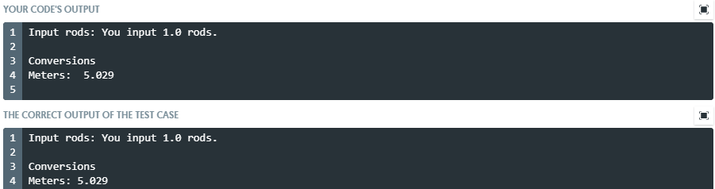
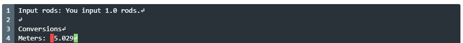

# Lab 10

[Download this folder's content (*.zip file)](https://github.com/braedynl/CSE231-GITHUB/raw/master/assets/packages/lab10.zip).

Due: by the end of class on Friday, November 13th (11/13/2020) if you have meetings. Friday, November 13th (11/13/2020) at 11:59 PM EST if you are online.

## Logistics

The submission page for all labs are on [Mimir](https://class.mimir.io/). You can submit an infinite amount of times before the deadline. The _best_ submission is graded by the TAs (i.e. the one that passes the most test-cases).

Lab grading is lenient. You do not have to pass all of the test-cases to get full credit, though you should try to. I will give you a warning if I need to see more work from you in the future. Following the coding standard is not required, but I encourage it.

Hard-coding a solution will net you a 0% grade for the lab. Wikipedia defines hard-coding as: 

> "... the software development practice of embedding data directly into the source code of a program or other executable object, as opposed to obtaining the data from external sources or generating it at run-time."

Some examples are (but not limited to): copying Mimir's expected output and printing it directly, copying a line or multiple lines directly from a file and placing it in your program, developing an algorithm that assumes too much about the inputs/data (and wouldn't work with other inputs/data that follow the same structure). 

Labs are meant to be collaborative. I encourage you to contact [me](../README.md#braedyn-lettinga) or your friends/acquaintances. [Piazza](https://piazza.com/), and the [help room](https://www.cse.msu.edu/~cse231/Online/General/ta.consulting.FS20.html) are also great places to seek additional help. 

Read through **all** of the instructions _carefully **and** thoroughly_. If you are having trouble comprehending the instructions, please don't hesitate to ask us on Piazza.

Starter-code is given for certain labs. If the lab's Python file is empty, that means there is no starter-code. In the case that some starter-code is given, you will want to _add_ to what's already written. Lines that _are_ written are there to help.

When submitting to Mimir, ensure that your file is properly named. The format is "labXX.py", where "XX" is the lab's corresponding number. A leading zero is used for single-digit lab numbers, and alphabetical characters are always kept lowercase. If you download the files directly from this repository, this shouldn't be much of an issue.

There is a file named [SHORTCUTS.md](../SHORTCUTS.md) on here that is a huge list of some of the most useful keyboard shortcuts for quicker debugging and writing. 

## Mimir Test-Case Explanation, Fixing Diff Descrepancies

When you click on a Mimir test-case, it will show a few things: the input of the test-case (what Mimir tried entering to your `input()` call(s)), your code's output (any expressions that displayed text to the console, such as `print()` statements, or the prompt argument given to `input()`), the correct output of the test case (what you should be outputting *based on* Mimir's input(s)), and two "diff" windows.

Think of diffs as small programs that examine the differences between your code's output and the expected output. The "unix diff" shows what lines in your output (the top-half, above the "`---`") are different from the lines in the expected output (the bottom-half, below the "`---`"). I would simply look at the unix diff window for this purpose alone. The numeric codes that you'll see, e.g. "`3,2c4,9`", tend to be hard to understand for most new programmers. The "pretty diff" is much more understandable. You can read about the unix diff [here](https://www.computerhope.com/unix/udiff.htm) if you're interested. 

The pretty diff "is colored to make it clear what parts of the output are wrong. Green indicates things in the correct output that you are missing, red indicates things in your output that shouldn't be there ... The ↵ character refers to newlines". The "newlines" they mention in this explanation is in reference to this: "`\n`" -- the newline _character_ (it's two separate characters but think of it as just one). The newline character essentially tells your computer to hit the ENTER/RETURN key. Here's an example:

Without a newline:
```python
print('hello')
print('hello again')
```
Output:
```
hello
hello again
```

With a newline:
```python
print('hello\n')  # newline concatenated to the back
print('hello again')
```
Output:
```
hello

hello again
```

It's important to note here, that the `print()` function will add a newline for you by default. This is the reason why subsequent `print()` expressions output on separate lines. You can change this behaviour by invoking the `print()` function's "`end`" parameter. 

Without `end`:
```python
print('hello')
print('hello again')
```
Output:
```
hello
hello again
```

With `end`:
```python
print('hello', end='')  # setting it to empty string
print('hello again')
```
Output:
```
hellohello again
```

Likely the most common pretty diff discrepancy you'll encounter is a space nested within your strings. Let's say I'm working on Project 01, and this is what I have so far:

Code:
```python
rods = float(input('Input rods: '))

# (there is code in-between these two lines that I'm hiding)

print("Meters: ", round(meters, 3))
```
Mimir test-case:

<div align="center">
    </img>
</div>

Pretty diff:

<div align="center">
    </img>
</div>

There appears to be an extra space, as highlighted in red. Let's take a look at the line of code that's outputting this:

```python
print("Meters: ", round(meters, 3))
```

You'll notice we have a space directly after the colon, which is what we want, right? Where is that extra space coming from? Well, when you comma-separate values in the `print()` function, Python will insert a space in-between those values. Example:

```python
print(1, 2, 3)
```
Output:
```
1 2 3
```

So, going back to our project, we're effectively outputting: `"Meters: "` + `" "` + `"5.029"`. 

We can alter this behaviour in a variety of ways. I typically use the "`sep`" parameter of `print()`, which specifies the string to insert between the values in the function call. 

```python
print(1, 2, 3, sep='')  # setting it to empty string
```
Output:
```
123
```

In the case of our project, we could also remove the space after the colon to achieve the same effect:

```python
print("Meters:", round(meters, 3))
#             ^ without space

# alternatively: 
# `print("Meters: ", round(meters, 3), sep='')`
#                ^ with space
```
Output:
```
Meters: 5.029
``` 

